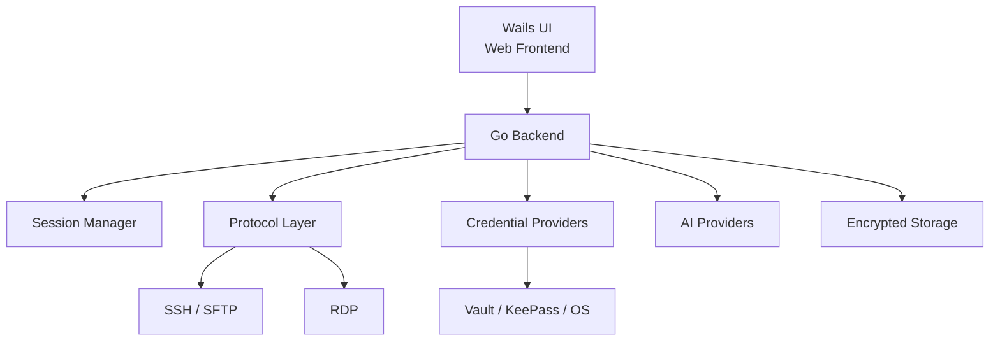

<p align="center">
  
</p>

<h1 align="center">Eiksy</h1>

<p align="center">
  <strong>Think. Connect. Operate.</strong><br>
  AI-powered remote operations workstation for infrastructure
</p>

<p align="center">
  <a href="https://github.com/burenk0v/eiksy/releases/latest">
    
  </a>
  <a href="https://github.com/burenk0v/eiksy/actions">
    
  </a>
  <a href="https://github.com/burenk0v/eiksy/blob/main/LICENSE">
    
  </a>
</p>

<p align="center">
  <a href="https://github.com/burenk0v/eiksy/releases/latest">Download</a> ·
  <a href="https://github.com/burenk0v/eiksy/issues">Issues</a> ·
  <a href="https://github.com/burenk0v/eiksy/security">Security</a>
</p>

---

## What is Eiksy?

**Eiksy is an AI-powered remote operations workstation for infrastructure engineers, DevOps engineers and system administrators.**

It combines **AI assistance, terminal access, SSH, SFTP, RDP, remote file management and secure credential storage** in a single cross-platform desktop application.

Instead of switching between an SSH client, terminal emulator, SFTP client, RDP application, password manager and AI assistant, Eiksy provides one workspace for **secure infrastructure operations**.

Eiksy is designed for people who work with remote servers and infrastructure every day and want AI to become a useful part of their workflow — without giving an AI agent uncontrolled access to production systems.

### In short

**Eiksy = AI + Terminal + SSH/SFTP + RDP + Credentials + Infrastructure Operations**

### Documentation

- [Architecture](docs/architecture.md) — application architecture, boundaries, security invariants and extension rules.
- [AI](docs/ai.md) — AI architecture, context, tools, command execution, diagnostics, remediation and AI security model.

---

## Why Eiksy?

Modern infrastructure workflows often require several separate tools:

```text
Terminal
   +
SSH client
   +
SFTP client
   +
RDP client
   +
Password manager
   +
AI assistant
   =
Too many tools
```

Eiksy brings these workflows together:

```text
                 ┌─────────────────────┐
                 │       Eiksy         │
                 │                     │
                 │  AI Assistant       │
                 │  SSH / SFTP         │
                 │  RDP                │
                 │  File Management    │
                 │  Credentials        │
                 │  Remote Operations  │
                 └─────────────────────┘
                           │
                           ▼
                     Infrastructure
```

The goal is not to build another chat application.

The goal is to make **AI a natural part of everyday infrastructure operations**.

---

## Key features

### AI-assisted infrastructure operations

Eiksy supports OpenAI-compatible AI providers and can connect AI assistance directly to the infrastructure workflow.

Supported configuration includes:

- custom API endpoints;
- authentication tokens;
- model selection;
- provider-specific settings;
- local Qwen3 4B (Q4_K_M) model download and launch;
- custom local model URLs.

Both **cloud AI** and **self-hosted/local AI** workflows are supported.

The long-term direction is an AI assistant that can understand the current infrastructure context and help the operator investigate, diagnose and execute tasks — while keeping the human in control.

### SSH

Eiksy provides a full SSH workflow:

- SSH terminal sessions;
- import of existing SSH configuration;
- `ProxyJump` support;
- SSH agent integration;
- local SSH tunnels;
- encrypted SSH key passphrases;
- saved connection profiles;
- session history;
- multiple active sessions.

Eiksy can therefore be used as a **modern SSH client and terminal workstation** for remote infrastructure.

### SFTP

Remote file operations are available alongside SSH sessions:

- remote file browsing;
- directory navigation;
- file transfers;
- remote file editing;
- SFTP sessions alongside SSH.

This eliminates the need to switch between a terminal and a separate SFTP application for common administration tasks.

### RDP

RDP support is part of the Eiksy remote-session architecture and is actively being developed.

The long-term goal is to provide SSH, SFTP and RDP workflows from the same operations workstation.

---

## Secure credential management

Infrastructure tools handle sensitive information.

Eiksy therefore provides a common credential-provider abstraction for different storage backends:

- HashiCorp Vault;
- KeePass;
- Windows Password Manager;
- local encrypted storage.

Sensitive local data is protected using:

- OS keychain-backed master-password flow;
- Argon2id key derivation;
- XChaCha20-Poly1305 encryption;
- encrypted SQLite storage.

The architecture is designed so that credentials can remain separate from ordinary application configuration.

---

## AI with human-in-the-loop security

Giving an AI agent unrestricted access to infrastructure creates obvious security risks.

Eiksy follows a **human-in-the-loop** approach.

```text
User
  │
  ▼
Eiksy
  │
  ├── Remote session
  ├── Infrastructure context
  ├── Credentials
  └── AI assistant
          │
          ▼
     Suggested action
          │
          ▼
         User
          │
          ▼
     Approved action
```

The user remains the final decision maker.

Potentially destructive infrastructure operations should not silently become autonomous actions.

The long-term goal is to combine the productivity of AI agents with the safety requirements of real infrastructure.

---

## Security principles

Security is a core part of the Eiksy architecture.

The application can work with credentials and remote infrastructure, so security is treated as a design requirement rather than an optional feature.

Eiksy follows several principles:

- secrets should never be stored in plaintext;
- credentials should be separated from ordinary application configuration;
- external secret stores should be supported whenever possible;
- AI should not automatically receive unrestricted infrastructure access;
- potentially destructive operations should remain under user control;
- sensitive information should not be written to logs;
- security-sensitive functionality should be designed for auditability.

For security vulnerabilities, please follow [`SECURITY.md`](./SECURITY.md) rather than opening a public issue.

---

## Architecture

Eiksy follows a backend-first desktop architecture built with **Go and Wails**.



The frontend is intentionally kept relatively thin.

Core application logic, session management, credential handling and integrations belong to the Go backend.

This keeps the architecture easier to test, maintain and extend.

---

## Eiksy as a MobaXterm alternative

If you are looking for a **MobaXterm alternative**, SSH client, SFTP client or remote operations workstation with integrated AI, Eiksy explores a different approach.

Traditional remote-access tools primarily focus on connecting to infrastructure.

Eiksy adds another layer:

```text
Remote Access
      +
Infrastructure Tools
      +
Secure Credentials
      +
AI Assistance
```

The objective is not simply to reproduce an existing terminal application.

Eiksy aims to become an **AI-native operations workstation**.

---

## Supported workflows

Eiksy is intended for workflows such as:

- connecting to Linux servers over SSH;
- managing remote files through SFTP;
- working with multiple remote sessions;
- accessing Windows systems through RDP;
- using Vault or KeePass for credentials;
- investigating infrastructure problems with AI assistance;
- using local/self-hosted AI models;
- combining terminal work and AI assistance;
- developing repeatable infrastructure operations workflows.

---

## Download

Download the latest release from GitHub:

[Download the latest release](https://github.com/burenk0v/eiksy/releases/latest)

Currently available platforms include:

- Windows x64
- Linux x64

Additional platforms may be added as the project evolves.

---

## Installation

### Windows

1. Open the [latest release](https://github.com/burenk0v/eiksy/releases/latest).
2. Download the Windows x64 binary.
3. Run `eiksy.exe`.

No Go or Node.js installation is required for pre-built binaries.

### Linux

1. Open the [latest release](https://github.com/burenk0v/eiksy/releases/latest).
2. Download the Linux x64 binary.
3. Make it executable:

```bash
chmod +x eiksy-linux-amd64
```

4. Run:

```bash
./eiksy-linux-amd64
```

Depending on your Linux distribution, Wails/WebKit runtime dependencies may be required.

---

## Development

### Requirements

- Go 1.25+
- Node.js 20+
- Wails CLI 2.14.0
- Platform-specific Wails dependencies

### Clone

```bash
git clone https://github.com/burenk0v/eiksy.git
cd eiksy
```

### Install frontend dependencies

```bash
cd frontend
npm ci
cd ..
```

### Development mode

```bash
wails dev
```

### Backend tests

```bash
go test ./...
```

### Frontend build

```bash
cd frontend
npm run build
```

---

## Building

Build output is placed in:

```text
build/bin/
```

### Linux

Install the required build dependencies:

```bash
sudo apt-get update

sudo apt-get install -y --no-install-recommends \
  build-essential \
  libgtk-3-dev \
  libwebkit2gtk-4.1-dev
```

Build:

```bash
wails build \
  -clean \
  -platform linux/amd64 \
  -tags webkit2_41 \
  -o eiksy-linux-amd64
```

### Windows

```bash
wails build \
  -clean \
  -platform windows/amd64 \
  -o eiksy-windows-amd64.exe
```

---

## CI/CD

GitHub Actions automatically builds the application for supported platforms.

The build pipeline:

1. Checks out the source code.
2. Installs Go and Node.js.
3. Installs the pinned Wails CLI.
4. Installs frontend dependencies.
5. Builds Linux and Windows binaries.
6. Uploads build artifacts.

Release builds are created automatically when a version tag matching:

```text
vX.Y.Z
```

is pushed.

---

## Configuration and secrets

Never commit sensitive information to the repository.

Do not commit:

- `.env`;
- passwords;
- API tokens;
- Vault tokens;
- SSH private keys;
- RDP credentials;
- certificates containing private keys.

Use the application's encrypted storage or an external credential provider for sensitive data.

---

## Project status

Eiksy is an actively developed open-source project.

Current development focuses on building a reliable foundation for:

- remote infrastructure access;
- secure credential management;
- AI-assisted operations;
- cross-platform desktop workflows;
- extensible protocol support;
- controlled AI interaction with infrastructure.

Some components are still evolving and may change between releases.

---

## Roadmap

Planned areas of development include:

- [ ] Improved RDP experience
- [ ] Expanded AI-assisted operations
- [ ] AI-powered terminal assistance
- [ ] Advanced Vault integration
- [ ] Additional credential providers
- [ ] Improved connection import/export
- [ ] More Linux distributions
- [ ] macOS support
- [ ] Automated security testing
- [ ] AI-assisted infrastructure diagnostics
- [ ] Controlled AI command execution
- [ ] Approval and audit mechanisms
- [ ] Improved UI/UX

The roadmap is intentionally flexible and will evolve with the project.

---

## Why Go + Wails?

### Go

Go provides:

- efficient concurrency;
- strong networking capabilities;
- a small runtime footprint;
- cross-platform support;
- simple distribution as a native binary;
- a mature ecosystem for infrastructure tooling.

### Wails

Wails combines:

- a native Go backend;
- a modern web-based UI;
- desktop application capabilities.

This allows Eiksy to keep infrastructure logic in Go while maintaining a flexible and modern user interface.

---

## Development philosophy

Eiksy is developed using an AI-assisted development workflow, including GitHub Copilot.

AI tools are used to accelerate implementation, exploration and refactoring.

Architecture, security decisions, testing and final engineering decisions remain under human control.

The project follows a pragmatic vibe-coding approach:

> Rapid iteration. Pragmatic decisions. Continuous refinement.

AI is a development tool — not a substitute for engineering, testing or security review.

---

## Contributing

Contributions, bug reports, ideas and security improvements are welcome.

Before opening a pull request:

- keep changes focused;
- avoid committing secrets;
- add or update tests where appropriate;
- follow the existing project architecture;
- document significant behavior changes.

For security vulnerabilities, please follow [`SECURITY.md`](./SECURITY.md) instead of opening a public issue.

---

## Support

If you find Eiksy useful and want to support its development, see [`SUPPORT.md`](./SUPPORT.md).

---

## License

Eiksy is licensed under **Apache-2.0**.

See [`LICENSE`](./LICENSE) for the full license text.

---

<p align="center">
  <strong>Eiksy — Think. Connect. Operate.</strong>
</p>
