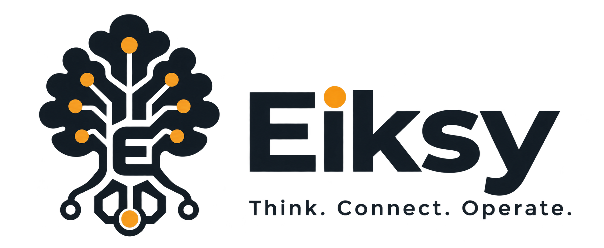
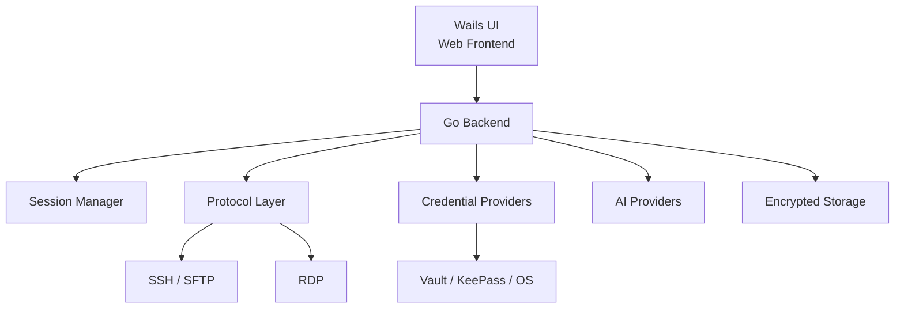

<p align="center">
  
</p>

<h1 align="center">Eiksy</h1>

<p align="center">
  <strong>Think. Connect. Operate.</strong><br>
  Secure remote operations workstation with AI at your side.
</p>

<p align="center">
  <a href="https://github.com/burenk0v/eiksy/releases/latest">
    
  </a>
  <a href="https://github.com/burenk0v/eiksy/actions">
    
  </a>
  <a href="https://github.com/burenk0v/eiksy/blob/main/LICENSE">
    
  </a>
</p>

<p align="center">
  <a href="https://github.com/burenk0v/eiksy/releases/latest">Download</a> ·
  <a href="https://github.com/burenk0v/eiksy/issues">Issues</a> ·
  <a href="https://github.com/burenk0v/eiksy/security">Security</a>
</p>

---

## What is Eiksy?

Eiksy is a cross-platform remote operations workstation built with Go and Wails.

It brings remote access, file management, credentials, and AI-assisted operations into a single desktop application.

Instead of switching between terminal clients, SFTP tools, RDP applications, password managers, and AI assistants, Eiksy aims to provide one secure workspace for working with infrastructure.

---

## Features

### SSH

- SSH terminal sessions
- Import existing SSH configuration
- "ProxyJump" support
- SSH agent integration
- Local SSH tunnels
- Encrypted SSH key passphrases
- Saved connection profiles
- Session history
- Multiple active sessions

### SFTP

- Remote file browsing
- Directory navigation
- File transfers
- Remote file editing
- SFTP alongside SSH sessions

### RDP

RDP support is part of the remote-session architecture and is being actively developed.

### Credential management

Eiksy provides a common credential-provider abstraction for different storage backends:

- HashiCorp Vault
- KeePass
- Windows Password Manager
- Local encrypted storage

Sensitive local data is protected using:

- OS keychain-backed master-password flow
- Argon2id key derivation
- XChaCha20-Poly1305 encryption
- encrypted SQLite storage

### AI

Eiksy supports OpenAI-compatible AI providers.

Providers can be configured with:

- custom API endpoint
- authentication token
- model selection
- provider-specific settings

This makes it possible to use both cloud-based and self-hosted AI services.

The goal is not to build another chat application.

The goal is to make AI a natural part of everyday infrastructure operations.

---

## Architecture

Eiksy follows a backend-first desktop architecture.



The frontend is intentionally kept relatively thin.

Core application logic, session management, credential handling and integrations belong to the Go backend.

This keeps the architecture easier to test, maintain and extend.

---

## AI-assisted operations

AI can be extremely useful when working with infrastructure — but unrestricted AI access to production systems creates obvious security risks.

Eiksy is designed around a human-in-the-loop approach.

```text
User
  │
  ▼
eiksy
  │
  ├── Remote session
  ├── Infrastructure context
  ├── Credentials
  └── AI assistant
          │
          ▼
     Suggested action
          │
          ▼
         User
```

The user remains the final decision maker.

The long-term goal is to provide powerful AI assistance without turning the workstation into an uncontrolled autonomous infrastructure agent.

---

## Security

Security is a core part of the Eiksy architecture.

The application can work with sensitive credentials and remote infrastructure, so security is treated as a design requirement rather than an optional feature.

### Security principles

- Secrets should never be stored in plaintext.
- Credentials should be separated from ordinary application configuration.
- External secret stores should be supported whenever possible.
- AI should not automatically receive unrestricted access to infrastructure.
- Potentially destructive operations should remain under user control.
- Sensitive information should not be written to logs.

### Local secret storage

Local sensitive data is protected using:

- OS keychain-backed master-password flow
- Argon2id key derivation
- XChaCha20-Poly1305 encryption
- encrypted SQLite storage

For security vulnerabilities, please follow the instructions in [`SECURITY.md`](./SECURITY.md) rather than opening a public issue.

---

## Download

Download the latest release from GitHub:

[Download the latest release](https://github.com/burenk0v/eiksy/releases/latest)

Currently available platforms include:

- Windows x64
- Linux x64

Additional platforms may be added as the project evolves.

---

## Installation

### Windows

1. Open the [latest release](https://github.com/burenk0v/eiksy/releases/latest).
2. Download the Windows x64 binary.
3. Run `eiksy.exe`.

No Go or Node.js installation is required for pre-built binaries.

### Linux

1. Open the [latest release](https://github.com/burenk0v/eiksy/releases/latest).
2. Download the Linux x64 binary.
3. Make it executable:

```bash
chmod +x eiksy-linux-amd64
```

4. Run:

```bash
./eiksy-linux-amd64
```

Depending on your Linux distribution, Wails/WebKit runtime dependencies may be required.

---

## Development

### Requirements

- Go 1.25+
- Node.js 20+
- Wails CLI 2.14.0
- Platform-specific Wails dependencies

### Clone

```bash
git clone https://github.com/burenk0v/eiksy.git
cd eiksy
```

### Install frontend dependencies

```bash
cd frontend
npm ci
cd ..
```

### Development mode

```bash
wails dev
```

### Backend tests

```bash
go test ./...
```

### Frontend build

```bash
cd frontend
npm run build
```

---

## Building

Build output is placed in:

```text
build/bin/
```

### Linux

Install the required build dependencies:

```bash
sudo apt-get update

sudo apt-get install -y --no-install-recommends \
  build-essential \
  libgtk-3-dev \
  libwebkit2gtk-4.1-dev
```

Build:

```bash
wails build \
  -clean \
  -platform linux/amd64 \
  -tags webkit2_41 \
  -o eiksy-linux-amd64
```

### Windows

```bash
wails build \
  -clean \
  -platform windows/amd64 \
  -o eiksy-windows-amd64.exe
```

---

## CI/CD

GitHub Actions automatically builds the application for supported platforms.

The build pipeline:

1. Checks out the source code.
2. Installs Go and Node.js.
3. Installs the pinned Wails CLI.
4. Installs frontend dependencies.
5. Builds Linux and Windows binaries.
6. Uploads build artifacts.

Release builds are created automatically when a version tag matching:

```text
vX.Y.Z
```

is pushed.

For example:

```bash
git tag vX.Y.Z
git push origin vX.Y.Z
```

The README intentionally uses the latest release instead of referencing a specific version.

---

## Configuration and secrets

Never commit sensitive information to the repository.

Do not commit:

- `.env`
- passwords
- API tokens
- Vault tokens
- SSH private keys
- RDP credentials
- certificates containing private keys

Use the application's encrypted storage or an external credential provider for sensitive data.

---

## Project status

Eiksy is an actively developed open-source project.

The project is currently focused on building a reliable foundation for:

- remote infrastructure access
- secure credential management
- AI-assisted operations
- cross-platform desktop workflows
- extensible protocol support

Some components are still evolving and may change between releases.

---

## Roadmap

Planned areas of development include:

- [ ] Improved RDP experience
- [ ] Expanded AI-assisted operations
- [ ] AI-powered terminal assistance
- [ ] Advanced Vault integration
- [ ] Additional credential providers
- [ ] Improved connection import/export
- [ ] More Linux distributions
- [ ] macOS support
- [ ] Automated security testing
- [ ] AI-assisted infrastructure diagnostics
- [ ] Controlled AI command execution
- [ ] Approval and audit mechanisms
- [ ] Improved UI/UX

The roadmap is intentionally flexible and will evolve with the project.

---

## Why Go + Wails?

### Go

Go provides:

- efficient concurrency
- strong networking capabilities
- a small runtime footprint
- cross-platform support
- simple distribution as a native binary
- a mature ecosystem for infrastructure tooling

### Wails

Wails combines:

- a native Go backend
- a modern web-based UI
- desktop application capabilities

This allows Eiksy to keep infrastructure logic in Go while maintaining a flexible and modern user interface.

---

## Development philosophy

Eiksy is developed using an AI-assisted development workflow, including GitHub Copilot.

AI tools are used to accelerate implementation, exploration and refactoring.

Architecture, security decisions, testing and final engineering decisions remain under human control.

The project follows a pragmatic vibe-coding approach:

«Rapid iteration. Pragmatic decisions. Continuous refinement.»

AI is a development tool — not a substitute for engineering, testing or security review.

---

## Contributing

Contributions, bug reports, ideas and security improvements are welcome.

Before opening a pull request:

- keep changes focused;
- avoid committing secrets;
- add or update tests where appropriate;
- follow the existing project architecture;
- document significant behavior changes.

For security vulnerabilities, please follow [`SECURITY.md`](./SECURITY.md) instead of opening a public issue.

---

## Support

If you find Eiksy useful and want to support its development, see [`SUPPORT.md`](./SUPPORT.md).

---

## License

Eiksy is licensed under **Apache-2.0**.

See [`LICENSE`](./LICENSE) for the full license text.

---

<p align="center">
  <strong>Think. Connect. Operate.</strong>
</p>
